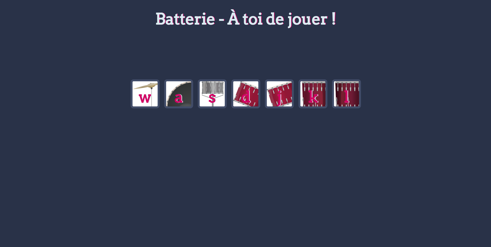

# Drum Kit – Play Sounds with Keyboard or Mouse

[]()

FRENCH VERSION – A lightweight and responsive drum kit built with **HTML**, **CSS**, and **Javascript**. Interact using your **keyboard** or **mouse** to play various percussion sounds.

## ✨ Features

- **Interactive UI:** Click or press keys to trigger drum sounds.
- **Audio Feedback:** Real-time audio response with smooth playback.
- **Keyboard Support:** Each key corresponds to a drum sound.
- **Responsive Design:** Works across all screen sizes (desktop, tablet, mobile).
- **Modular Architecture:** Clean separation between views, logic, and static assets.

## 🛠️ Technologies Used

- **Frontend:**
  - HTML
  - CSS
  - Javascript (Vanilla)
- **Other:**
  - Git (version control)

## 🚀 Installation

1. **Clone the repository:**

   ```bash
   git clone https://github.com/Antoinekoe/drum-kit.git
   cd drumkit
   ```

2. **Open the project in your browser:**
   You can use a local server like Live Server (VS Code extension), or simply open index.html in your preferred browser.

## 🗂️ Project Structure

```
DrumKit/
├── images/         # Images for the drum kit interface
├── sounds/         # Audio files for each drum sound
│   ├── crash.mp3
│   ├── kick-bass.mp3
│   ├── snare.mp3
│   └── ...
├── .gitignore      # Specifies intentionally untracked files that Git should ignore
├── index.html      # Main HTML file structure for the drum kit
├── index.js        # JavaScript file for handling drum kit functionality (keyboard presses, sound playback)
├── LICENSE         # License information
├── README.md       # Project description and instructions
└── styles.css      # CSS file for styling the drum kit elements
```

## 🤝 How to Contribute

1. Fork the repository.
2. Create your feature or bugfix branch:
   ```bash
   git checkout -b feature/awesome-sound
   ```
3. Commit your changes clearly.
4. Push your branch and open a Pull Request.

## 🔧 Potential Improvements (TODO)

- Add volume controls.
- Enable recording and playback of sequences.
- Add visual feedback (animations, pressed key effects).
- Include touch support for mobile users.
- Implement sound packs (e.g., rock, hip-hop, electronic).
- Add dark/light theme toggle.

## 🔑 License

Licensed under the MIT License. See the [LICENSE](LICENSE) file for details.
